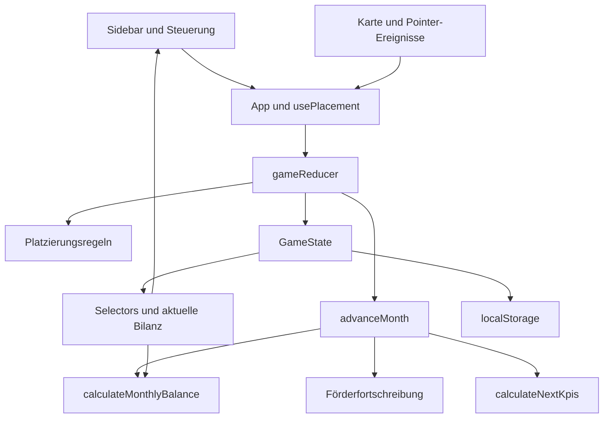

# Architektur

## Überblick

Die Anwendung läuft vollständig im Browser. React komponiert die Oberfläche,
Leaflet zeichnet Karte und Anlagen. Ein Reducer verwaltet den Spielstand;
reine TypeScript-Funktionen berechnen die Simulation. Es gibt weder Backend
noch Benutzerkonten. Die separate Python-Simulation dient dem Balancing.

## Modulgrenzen

| Bereich | Verantwortung |
|---|---|
| `app/App.tsx` | Oberfläche zusammensetzen, Reset und Einführung koordinieren |
| `app/appState.ts` | Reducer initialisieren, Zustand laden/speichern, Speicherstatus anzeigen |
| `app/usePlacement.ts` | temporäre Auswahl, Drag-Zustand und Platzierungsfeedback |
| `game/reducer.ts` | validierte Spielaktionen, Kauf/Verkauf, Undo, Auswahl |
| `game/selectors.ts` | abgeleitete Werte; bestehende einzelne Selectors bleiben verfügbar |
| `simulation/monthlySimulation.ts` | zeitliche Reihenfolge und Übergang zum nächsten Spielzustand |
| `simulation/monthlyBalance.ts` | gemeinsame Energie- und Kostenberechnung für UI und Abrechnung |
| `simulation/subsidySimulation.ts` | kumulierte Förderung und neue private Anlagen |
| `simulation/kpiCalculation.ts` | Autarkie, Zufriedenheit und Versorgungssicherheit |
| `simulation/weatherSimulation.ts` | reproduzierbares Wetter und Prognose |
| `map/BochumMap.tsx` | Leaflet-Layer, Zonenstile und Anlagenmarker |
| `map/mapInteractions.tsx` | Bildschirmkoordinaten, Pointer-Ereignisse, Kartenklicks und Label-Pane |
| `map/ZoneInfoCard.tsx`, `zoneInfoPosition.ts` | Zoneninformationen und Positionierung der Detailkarte |
| `persistence/` | Browser-Speicher und Kompatibilitätsdefaults |
| `data/`, `types/` | Parameter, Kartendaten und gemeinsame Verträge |

Pfade in dieser Tabelle liegen unter `frontend/src/`.

## Eine Spielaktion verfolgen

Beim Ablegen einer Anlage übersetzt die Karte die Bildschirmposition in
Breiten-/Längengrad. `usePlacement` bestimmt die Zone und fragt `canPlaceItem`
für das Feedback ab. Nur ein erlaubter Drop erzeugt `PLACE_ASSET`. Der Reducer
prüft die Regeln nochmals, zieht den Kaufpreis ab, erstellt die Anlage im Bau
und legt einen Undo-Eintrag an. Die UI darf Budget oder Kapazität nicht selbst
ändern. `useAppState` speichert den neuen Zustand anschließend im Browser.

Temporäres Feedback, offene Dialoge und Pointer-Positionen gehören nicht in den
persistierten Spielstand. Beim Neustart wird die Karte über einen neuen React-Key
zurückgesetzt, damit auch ihre lokale Zonenauswahl verschwindet.

## Reihenfolge der Monatsabrechnung

`advanceMonth(state)` gibt für beendete Spiele denselben Zustand zurück.
Für ein laufendes Spiel gilt diese Reihenfolge:

1. Nächsten Monatsindex bestimmen und fertiggestellte öffentliche Anlagen aktivieren.
2. Förderausgaben fortschreiben; pro erreichtem Schwellenbetrag private Anlagen
   und Kapazität ergänzen. Nicht ausgegebene Restbeträge bleiben erhalten.
3. Energie für den **bisherigen** Monatsindex mit dessen Wetter und Nachfrage
   abrechnen. Gerade aktivierte Anlagen und neue private Kapazitäten wirken bereits.
4. Produktion, bisherigen Speicherinhalt und private Versorgung gegen den Bedarf
   rechnen; Importe, Einnahmen, Betrieb und Förderung bilanzieren.
5. Budget auf ganze Euro runden und auf mindestens null begrenzen; KPIs berechnen.
6. Eine Historienzeile mit Anfangsbudget/-KPIs/-Speicher und den Strömen dieses
   Monats anhängen; Undo leeren und die neue Wetterprognose erstellen.
7. Verlustbedingungen prüfen. Eine Niederlage hat auch im letzten Monat Vorrang
   vor dem regulären Spielende. Bei Spielende den Score berechnen.

Diese Reihenfolge ist Teil des Modellvertrags. Sie darf beim Umordnen von Code
nicht versehentlich geändert werden.

## Vorschau und Abrechnung

`calculateMonthlyBalance(state, activeAssets, monthIndex, subsidies)` berechnet
die Bilanz ohne Seiteneffekte. `getCurrentMonthlyBalance(state)` verwendet nur
aktuell aktive Anlagen und die aktuelle private Kapazität. Die Abrechnung
übergibt dagegen bereits fertiggestellte Anlagen und fortgeschriebene Förderung.
Deshalb ist die Sidebar bei anstehenden Fertigstellungen keine exakte Vorhersage
des nächsten Budgetstands.

Im Startmonat unterdrückt die UI den angezeigten Importkostenwert. Der angezeigte
monatliche Saldo und die tatsächliche Abrechnung berücksichtigen Importe trotzdem.
Diese historisch gewachsene Anzeige ist durch Tests festgeschrieben.

## Speicherung und Kompatibilität

- Schlüssel: `bochum-smart-city:mvp1:v1`, Hülle: `{ version: 1, state: GameState }`.
- Der Einführungsstatus besitzt einen eigenen Schlüssel.
- Fehlende optionale Felder älterer Spielstände erhalten beim Laden Defaults:
  private Anlagen, Förderung, Speicher und zusätzliche Historienwerte.
- Ein fehlender Wetter-Seed wird deterministisch aus `gameId` abgeleitet; die
  Prognose wird dazu neu erzeugt. Alte Bestandsanlagen werden entfernt.
- Bei gesperrtem Speicher läuft das Spiel weiter und zeigt einen Hinweis.
- Die Laufzeitprüfung validiert bisher nur die Grundstruktur. Sie ersetzt keine
  vollständige Schema-Prüfung verschachtelter Daten; fremde Spielstandimporte sind
  keine unterstützte Schnittstelle.

Änderungen am Speicherformat benötigen Migrationstests. Den Schlüssel nicht
einfach umbenennen, da sonst vorhandene Spielstände nicht mehr gefunden werden.

## Karten und Modellgrenzen

GeoJSON liefert Stadt- und Bezirksgrenzen. Fachliche Zonenregeln liegen getrennt
in `zoneRules.ts`. Geografische Daten sind keine Aussage über reale Standorte oder
Leistungswerte von Anlagen. Kartenkacheln werden extern geladen, daher braucht
die Basiskarte eine Netzwerkverbindung. Die Simulationsregeln funktionieren lokal.

Die Label-Pane liegt unter den interaktiven Ebenen und hat keine Pointer-Ereignisse.
Leaflet verwaltet ihren Lebenszyklus; React-StrictMode darf sie beim Effect-Cleanup
nicht aus Leaflets interner Verwaltung entfernen.

## Python-Vergleichsmodell

`simulations/start_value_sweep.py` implementiert die Regeln unabhängig von
TypeScript. Es ist kein Laufzeitbestandteil der Webanwendung. Parameteränderungen
müssen in beiden Implementierungen überprüft werden. Reproduzierbare Seeds,
Strategien und dokumentierte Modellgrenzen sind wichtiger als eine einzelne
Erfolgsquote. Details: [Simulation](../simulations/README.md).
