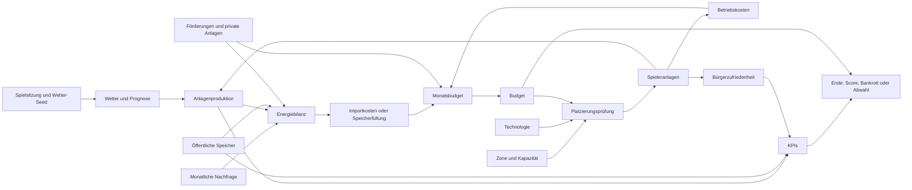

# Elemente und Abhängigkeiten der Bochum Smart City Simulation

Dieses Dokument beschreibt die aktuelle Spiel- und Systemlogik nach dem Produktions-Sweet-Spot-Merge. Die Werte sind MVP-Balancingwerte und keine realen Energieprognosen.

## 1. Gesamtzusammenhang



Die zentrale Spielschleife lautet:

```text
Prognose lesen
→ Technologie und Zone wählen
→ Budget, Kapazität und Akzeptanz prüfen
→ Anlage bauen oder Förderung setzen
→ Monatswechsel ausführen
→ Produktion, Nachfrage, Speicher und Kosten auswerten
→ nächste Entscheidung treffen
```

## 2. Elemente und Verantwortlichkeiten

| Element | Aufgabe | Abhängigkeiten | Ergebnis |
|---|---|---|---|
| Spielsitzung | hält den laufenden Spielstand | `gameId`, `weatherSeed`, `currentMonthIndex` | reproduzierbarer Spielverlauf |
| Wetter-Seed | erzeugt eine zufällige, aber stabile Wetterfolge | neue Sitzung oder alte `gameId` | Wettertyp und Produktionsfaktoren |
| Wetterprognose | zeigt drei Monate voraus | Monat, Wetter-Seed | Planung von Solar, Wind und Speicher |
| Technologie | definiert Kosten, Produktion und Wirkung | Solar, Wind oder Speicher | mögliche Anlage |
| Zone | definiert erlaubte Technologien und Kapazität | Standortdaten | Platzierungsregeln und Akzeptanzfaktor |
| Budget | begrenzt Käufe und laufende Kosten | Startbudget, Einnahmen, Importe, Kosten | Kaufmöglichkeit oder Bankrott |
| Spieleranlage | wird sofort bezahlt und später aktiviert | Technologie, Zone, Bauzeit | Produktion, Betriebskosten und KPI-Wirkung |
| Förderung | bezahlt private Kapazität und erzeugt Bürgerbonus | Programm, Level 0–3 | private Entlastung und laufende Kosten |
| Private Anlage | entsteht nach kumulierter Förderung | Förderprogramm, Schwelle 600.000 € | Netz-Entlastung ohne städtische Produktionseinnahmen |
| Nachfrage | bestimmt den monatlichen Energiebedarf | Kalendermonat | benötigte Energie und Stromerlös |
| Energiebilanz | verrechnet Energieangebot und Nachfrage | Produktion, Speicher, private Kapazität, Nachfrage | Überschuss oder Defizit |
| Monatsbudget | verrechnet alle monatlichen Geldflüsse | Erlös, Importe, Betrieb, Förderung | neuer Kontostand |
| KPIs | bewerten den Fortschritt | Produktion, Speicher, Mix, Akzeptanz, Förderung | Autarkie, Zufriedenheit, Sicherheit |
| Endzustand | beendet oder bewertet das Spiel | Monat 60, Budget, Bürgerzufriedenheit | Endscore, Bankrott oder Abwahl |

## 3. Wetter und Nachfrage

### Wetterwahrscheinlichkeiten

Jede neue Spielsitzung erhält einen eigenen Seed. Bei gleichem Seed ist der Verlauf reproduzierbar. Die Produktionswahrscheinlichkeiten des Sweet Spots sind:

| Jahreszeit | Sonnig | Gemischt | Bewölkt | Windig | Sturm |
|---|---:|---:|---:|---:|---:|
| Winter | 20 % | 10 % | 20 % | 30 % | 20 % |
| Frühling | 35 % | 35 % | 15 % | 10 % | 5 % |
| Sommer | 70 % | 15 % | 8 % | 5 % | 2 % |
| Herbst | 30 % | 25 % | 25 % | 15 % | 5 % |

Abhängigkeit:

```text
Jahreszeit + Wetter-Seed
→ Wettertyp
→ Solar- und Windfaktor
→ Produktion jeder aktiven Anlage
→ Energiebilanz und Importkosten
```

### Monatliche Nachfrage

| Monat | Nachfrage |
|---|---:|
| Januar | 95 |
| Februar | 90 |
| März | 80 |
| April | 72 |
| Mai | 65 |
| Juni | 60 |
| Juli | 60 |
| August | 63 |
| September | 70 |
| Oktober | 78 |
| November | 88 |
| Dezember | 100 |

Die Nachfrage beeinflusst direkt den Stromerlös und indirekt die Importkosten, wenn die Produktion nicht ausreicht.

## 4. Technologien

| Technologie | Kaufpreis | Produktion/Kapazität | Betriebskosten | Bürgerwirkung |
|---|---:|---:|---:|---:|
| Solaranlage | 1.200.000 € | `7 × Solarfaktor` | 35.000 €/Monat | `+1 × Akzeptanzfaktor` |
| Kleinwindanlage | 2.800.000 € | `14 × Windfaktor` | 400.000 €/Monat | `−3 × Akzeptanzfaktor` |
| Energiespeicher | 1.700.000 € | 10 Speichereinheiten | 45.000 €/Monat | 0 |

Für alle Spieleranlagen gilt:

```text
Platzierung
→ Kaufpreis sofort vom Budget abziehen
→ Status: im Bau
→ nach 1 Monat: aktiv
→ erst dann Produktion und Betriebskosten
```

## 5. Zonen, Technologie und Platzierung

| Zone | Solar | Wind | Speicher | Akzeptanz | Besonderheit |
|---|---:|---:|---:|---|---|
| Mitte | 12 | 0 | 5 | hoch (1,5) | kein Wind möglich |
| Wattenscheid | 10 | 2 | 4 | mittel (1,0) | flexibler Mischstandort |
| Nord | 9 | 2 | 3 | niedrig (0,5) | geringere Windstrafe |
| Ost | 10 | 2 | 4 | mittel (1,0) | flexibler Mischstandort |
| Süd | 9 | 0 | 4 | hoch (1,5) | Solar und Speicher |
| Südwest | 9 | 0 | 4 | hoch (1,5) | Solar und Speicher |

Eine Platzierung ist nur möglich, wenn alle Bedingungen erfüllt sind:

```text
Zone bekannt
→ Technologie in Zone erlaubt
→ freie Kapazität vorhanden
→ Budget reicht für Kaufpreis
→ Anlage wird angelegt
```

Die Zone wirkt außerdem auf die Bürgerzufriedenheit. Dadurch ist die Wahl des Standorts nicht nur eine Kapazitätsentscheidung.

## 6. Förderungen und private Anlagen

| Förderprogramm | Kosten je Level/Monat | private Kapazität je Level/Monat | Bürgerbonus je Level |
|---|---:|---:|---:|
| Solarförderung | 250.000 € | 0,1 Solar-Einheiten | 0,4 |
| Speicherförderung | 180.000 € | 0,1 Speicher-Einheiten | 0,25 |

Die Förderstufe liegt zwischen 0 und 3.

### Abhängigkeit der privaten Anlagen

```text
Förderstufe
→ monatliche Förderkosten
→ private Kapazität
→ private Solarproduktion oder Speicherentlastung
→ Versorgungssicherheit und geringere Importe
```

Zusätzlich wird der kumulierte Förderaufwand gezählt:

```text
kumulierte Förderung ≥ 600.000 €
→ private Anlage wird zufällig in Bochum platziert
→ Anlage ist sichtbar
→ Betriebskosten = 0 €
→ nicht verkaufbar und nicht modifizierbar
```

Private Anlagen liefern keine direkten Stromerlöse für die Stadt. Sie reduzieren jedoch den Energiebedarf aus dem öffentlichen Netz.

## 7. Energiebilanz und Monatsbudget

Die Energiebilanz lautet:

```text
öffentliche Produktion
+ gespeicherte Energie
+ private Solarproduktion
+ private Speicherentlastung
− monatliche Nachfrage
= Energiesaldo
```

Bei einem Defizit:

```text
Importkosten = |Energiesaldo| × 70.000 €
```

Bei einem Überschuss:

```text
neuer Speicherstand = min(Überschuss, öffentliche Speicherkapazität)
```

Nicht speicherbarer Überschuss verfällt.

Das Monatsbudget wird so berechnet:

```text
Stromerlös
− Importkosten
− Betriebskosten aktiver Anlagen
− Förderkosten
= monatliche Budgetänderung
```

Der aktuelle Stromerlös beträgt:

```text
monatliche Nachfrage × 38.000 €
```

Die Startparameter sind:

| Parameter | Wert |
|---|---:|
| Startbudget | 18.000.000 € |
| Importkosten | 70.000 €/fehlende Einheit |
| Stromerlös | 38.000 €/verkaufte Einheit |

## 8. KPI-Abhängigkeiten

### Energieautarkie

Steigt durch die öffentliche Produktion:

```text
neue Autarkie = alte Autarkie + Produktion × 0,35
```

Der Wert wird zwischen 0 und 100 begrenzt.

### Bürgerzufriedenheit

Die monatliche Veränderung setzt sich zusammen aus:

```text
Solarwirkung
+ Windwirkung × Akzeptanzfaktor
+ Solarförderung × 0,4
+ Speicherförderung × 0,25
```

### Versorgungssicherheit

Die monatliche Veränderung setzt sich zusammen aus:

```text
Speicherkapazität × 0,5
+ Solar-Wind-Mixbonus von 2
+ privater Speicherbonus bis maximal 4
```

Der Solar-Wind-Mixbonus greift, sobald mindestens eine aktive Solar- und eine aktive Windanlage existieren.

## 9. Monatswechsel und Statusänderungen

Beim Monatswechsel werden die Schritte in dieser Reihenfolge ausgeführt:

1. Monat erhöhen.
2. Anlagen mit abgelaufener Bauzeit aktivieren.
3. Förderkosten und private Kapazität berechnen.
4. Private Anlagen ab der 600.000-€-Schwelle erzeugen.
5. Öffentliche Produktion berechnen.
6. Nachfrage und private Solarproduktion berechnen.
7. Speicher entladen oder Überschuss speichern.
8. Importkosten, Erlöse, Betriebskosten und Förderkosten berechnen.
9. Budget aktualisieren.
10. KPIs aktualisieren.
11. Neue Drei-Monats-Prognose erzeugen.
12. Bankrott, Abwahl oder Abschluss prüfen.

Ein Spiel endet nach 60 Monaten. Es endet vorzeitig, wenn das Budget höchstens 0 € oder die Bürgerzufriedenheit höchstens 0 erreicht.

## 10. Technische Komponenten

```text
App
├── useAppState
│   ├── loadGameState / saveGameState
│   └── gameReducer
├── BochumMap
│   ├── CARTO oder OpenStreetMap
│   ├── Stadtgrenze
│   ├── Stadtteilgrenzen und Namen
│   └── Spieler- und private Anlagenmarker
├── Sidebar
│   ├── Wetterprognose
│   ├── KPI-Dashboard
│   ├── Förderungen
│   ├── Bauoptionen
│   ├── Anlagendetails
│   └── Endscreen
└── BottomControls
    ├── Undo
    └── Monatswechsel
```

Die wichtigsten Schnittstellen sind:

| Schnittstelle | Abhängigkeit |
|---|---|
| `createInitialGameState()` | Startbudget, Wetter-Seed, Prognose, KPIs |
| `loadGameState()` | `localStorage`, Migration alter Seeds |
| `gameReducer()` | Aktionen, Platzierungsregeln, Monatssimulation |
| `canPlaceItem()` | Zone, Technologie, Kapazität, Budget |
| `getCurrentEnergyProduction()` | aktive Anlagen, Technologie, Wetter-Seed |
| `advanceMonth()` | Wetter, Nachfrage, Anlagen, Förderungen, Speicher, Budget |
| `calculateFinalScore()` | Budget und KPIs |

## 11. Relevante Quelldateien

- `frontend/src/types/game.ts` – Spielzustand, Aktionen, KPIs und Monats-Snapshots
- `frontend/src/types/assets.ts` – Spieleranlagen und private Anlagen
- `frontend/src/data/gameBalance.ts` – zentrale Wirtschaftsparameter
- `frontend/src/data/itemDefinitions.ts` – Technologien und Anlagenwerte
- `frontend/src/data/zoneRules.ts` – Zonen, Kapazitäten und Akzeptanz
- `frontend/src/data/subsidyPrograms.ts` – Förderkosten und private Wirkung
- `frontend/src/data/energyDemand.ts` – monatliche Nachfrage
- `frontend/src/simulation/weatherSimulation.ts` – Seed, Wahrscheinlichkeiten und Prognose
- `frontend/src/simulation/placementRules.ts` – Platzierungsprüfung
- `frontend/src/simulation/monthlySimulation.ts` – Monatsbilanz und KPI-Fortschreibung
- `frontend/src/game/selectors.ts` – aktuelle Vorschauwerte für die UI
- `frontend/src/game/lossRules.ts` – Bankrott und Abwahl
- `frontend/src/simulation/scoring.ts` – Endscore
- `frontend/src/persistence/localStorageStore.ts` – Speicherung und Migration

## 12. Hinweis zur Dokumentationskonsistenz

Dieses Dokument verwendet die aktuellen Produktionswerte aus dem Code. Ältere Strategie- oder Draw.io-Dokumente können noch frühere Werte enthalten, zum Beispiel 60.000 € Importkosten, 80.000 € Windbetriebskosten oder höhere Förderwirkungen. Bei widersprüchlichen Angaben ist derzeit der Code unter `frontend/src/` maßgeblich.
